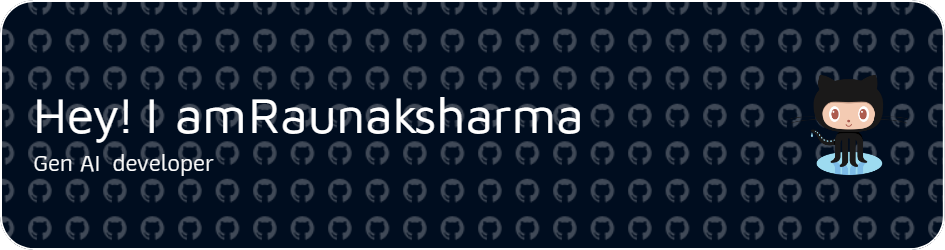

<h3 align="center">Visitors</h3>

  

<h3 align="center">About me</h3>

  

<h3 align="center">I dedicated and passionate student currently pursuing a Bachelor of Computer Applications (BCA). My interests and work revolve around software development and the exciting world of Artificial Intelligence (AI). I am continuously expanding my knowledge and skills in these fields, constantly seeking new challenges and opportunities to grow.</h3>

###

   <h3>Stats</h3>
  
  

<h3 align="center">Discord activity</h3>

    

<h3 align="center">Spotify recently played songs</h3>

  

###

  

###

 

  <h3>Languages and technologies🔥</h3>
  
  
  
  
  
  
  
  
  
    
  
  
  
  
  
  
  
  
  
  
  
  
  
  
  
  
  
  
  
  
  
    
  
  
  
  

  
  
  
  
  
  
  
  
  
  
  
  
  
  

###

 

  <h3>Social🧑🏻‍💻</h3>
  
  
  
  
  
  

###
